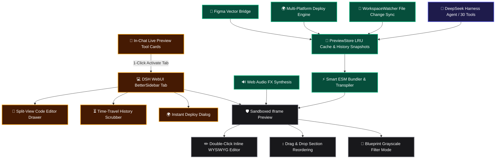

# 📦 @goodandready/dsh-live-canvas

<div align="center">

<h3>Interactive Visual Development Studio, Retool-Style CRUD Studio, Time-Travel Debugger, Instant Multi-Platform Deploy (Vercel, Cloudflare, Netlify, Gist), Figma Vector Bridge, Sound FX, and 30 Agent Tools for DeepSeek Harness</h3>

<p align="center">
  <a href="https://www.npmjs.com/package/@goodandready/dsh-live-canvas"></a>
  <a href="LICENSE"></a>
  <a href="https://github.com/topics/dsh-plugin"></a>
  <a href="https://nodejs.org"></a>
</p>

<p align="center">
  <a href="https://goodandready.app/"></a>
</p>

<p align="center">
  <a href="README.md"><b>🇬🇧 English</b></a> •
  <a href="README.ru.md"><b>🇷🇺 Русский</b></a> •
  <a href="README.zh.md"><b>🇨🇳 中文说明</b></a>
</p>

</div>

---

## ⚡ Overview & Capabilities: Milestone v0.2.0

**`dsh-live-canvas`** transforms DeepSeek Harness into a state-of-the-art visual frontend studio and interactive artifact runtime with **30 Agent Tools**:
- **🗄️ Retool-Style CRUD Admin Studio**: Searchable data grids, status filters, add/edit modals, and CSV export.
- **⏳ Time-Travel Debugger & Timeline Scrubber**: Step back and forth across iterations without git checkouts.
- **🌍 1-Click Multi-Platform Web Deploy**: Instant packaging for **Vercel**, **Cloudflare Pages**, **Netlify**, and **GitHub Gist**.
- **🎨 Figma & Penpot Vector Bridge**: Bi-directional conversion between Figma SVG vector markup and Tailwind components.
- **🔊 UI Sound FX & Micro-Interactions**: Zero-dependency Web Audio API tactile audio feedback.
- **📋 Effective HTML Suite**: Low-fi wireframes, persistent roadmaps, living architecture diagrams, and multi-step prototype flows.
- **💬 In-Chat Interactive Tool Cards**: Live embedded iframe preview in chat messages with 1-click BetterSidebar activation.

---

## 🏛️ Architecture Overview



---

## 🛠️ Complete Agent Tools Reference (30 Tools)

| Tool Name | Purpose | Output / Action |
|---|---|---|
| `live_canvas_preview` | Render or update preview session for HTML/React/SVG/Mermaid | `previewUrl`, `canvasId` |
| `live_canvas_inspect` | Retrieve user DOM clicks, CSS selectors, and attributes | `inspections: [...]` |
| `live_canvas_reload` | Force instant SSE reload on open preview windows | Hot-reload broadcast |
| `live_canvas_diagnose` | Query sandbox console errors and exceptions for self-healing | `logs: [...]`, `hasErrors` |
| `live_canvas_export` | Export standalone zero-dependency HTML bundle | `downloadUrl`, `savedPath` |
| `live_canvas_annotations` | Fetch or clear boxed visual markup and comments | `annotations: [...]` |
| `live_canvas_gallery` | Create multi-variant Storybook comparison matrix | `variantsCount`, `previewUrl` |
| `live_canvas_watch` | Scan and bind workspace files to live file watcher | `files: [...]`, `watchedFiles` |
| `live_canvas_controls` | Update Storybook-style interactive props sliders | `values: {...}` |
| `live_canvas_diff` | Visual split slider comparing two session snapshots | `diffUrl`, `snapshotCount` |
| `live_canvas_matrix` | Multi-device viewport matrix (Mobile, Tablet, Desktop) | `matrixUrl` |
| `live_canvas_mock` | Set up intercepted REST API mock routes in preview frame | `endpointsCount`, `mockData` |
| `live_canvas_pack` | 1-Click Vite+React or Vite+Vue project ZIP bundle packager | `downloadUrl`, `writtenDir` |
| `live_canvas_refine_element` | Target AI visual/structural refinement to a DOM element | Canvas hot-reload |
| `live_canvas_storybook` | Auto-scan workspace components and create UI Kit gallery | `galleryUrl`, `componentsCount` |
| `live_canvas_insert_block` | Insert curated design block (Hero, Bento, Pricing, FAQ, Footer) | `blockId`, `title` |
| `live_canvas_vision_import`| Convert image screenshot / mockup into interactive canvas | `previewUrl`, `framework` |
| `live_canvas_visual_audit` | Inspect canvas DOM for overflow, contrast, and layout issues | `score`, `issuesCount`, `issues` |
| `live_canvas_generate_mock`| Generate realistic mock JSON datasets and inject into sandbox | `datasetType`, `mockData` |
| `live_canvas_share` | Generate mobile QR code and local network preview URL | `shareUrl`, `qrSvg` |
| `live_canvas_create_wireframe` | Generate low-fidelity structural HTML wireframe artifact | `previewUrl`, `layout` |
| `live_canvas_create_plan` | Generate interactive HTML project plan & release roadmap | `previewUrl`, `version` |
| `live_canvas_create_diagram` | Generate living interactive architecture diagram artifact | `previewUrl`, `diagramType` |
| `live_canvas_create_prototype` | Generate multi-step interactive prototype wizard flow | `previewUrl`, `flowType` |
| `live_canvas_resolve_annotation` | Mark visual user annotation as resolved with notes | `status: 'resolved'` |
| `live_canvas_create_crud` | Generate Retool-style admin CRUD dashboard with table and modals | `previewUrl`, `entityName` |
| `live_canvas_timetravel` | Step through snapshot history timeline or restore revisions | `timetravelUrl`, `snapshotsCount` |
| `live_canvas_instant_deploy` | Generate ready-to-ship bundle for Vercel, Cloudflare, Netlify, Gist | `downloadUrl`, `instructions` |
| `live_canvas_figma_bridge` | Convert Figma SVG vector code to Tailwind or export component SVG | `action`, `componentName` |
| `live_canvas_sound_fx` | List or play synthesized Web Audio interaction feedback | `presetsCount`, `soundType` |

---

## 📦 Installation

```bash
dsh plugin --profile web add @goodandready/dsh-live-canvas
```

---

## 📄 License

MIT © [GooDAnDReaDY](https://github.com/GooDAnDReaDY)

