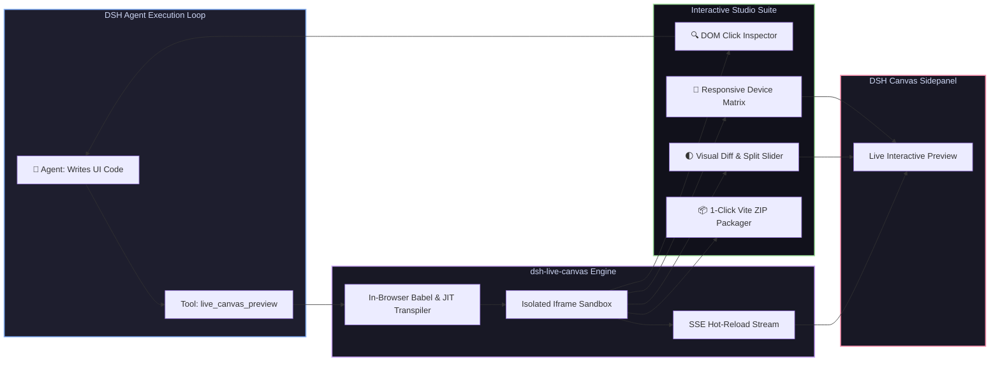

# 📦 @goodandready/dsh-live-canvas

<div align="center">

<h3>Real-Time Live Preview Sandbox, DOM Inspector, Visual Diff, Device Matrix & 1-Click Vite Packager for DeepSeek Harness</h3>

<p align="center">
  <a href="https://www.npmjs.com/package/@goodandready/dsh-live-canvas"></a>
  <a href="LICENSE"></a>
  <a href="https://github.com/topics/dsh-plugin"></a>
  <a href="https://nodejs.org"></a>
</p>

<p align="center">
  <a href="https://goodandready.app/"></a>
</p>

<p align="center">
  <a href="README.md"><b>🇬🇧 English</b></a> •
  <a href="README.ru.md"><b>🇷🇺 Русский</b></a> •
  <a href="README.zh.md"><b>🇨🇳 中文说明</b></a>
</p>

</div>

---

## ⚡ Overview

**`dsh-live-canvas`** equips **DeepSeek Harness** agents with an interactive, real-time in-browser sandbox for building, testing, and visualizing frontend interfaces on the fly.

Whenever an agent writes HTML, React 18 (JSX/TSX), Vue, SVG, Mermaid diagrams, or Markdown, `dsh-live-canvas` instantly compiles and renders the result with **SSE hot-reload, DOM click inspection, visual side-by-side diffing, multi-device viewport testing, and 1-click Vite ZIP export**.



---

## ✨ Key Capabilities & Studio Features

### 1. 🎨 Multi-Format Live Rendering
* **React 18 JSX/TSX**: In-browser Babel transpilation with React Error Boundaries and state persistence.
* **HTML + Tailwind CSS + Lucide Icons**: Instant compilation with Tailwind JIT CDN and icon substitution.
* **SVG Vector Art**: Clean SVG renderer with transparency checkerboard and zoom controls.
* **Mermaid & Markdown**: Live architectural diagrams (Flowcharts, Sequences) and GitHub Flavored Markdown.

### 2. 🔍 Interactive DOM Click Inspector (`live_canvas_inspect`)
Allows agents and users to hover over and click any rendered element to capture:
* Exact CSS selector hierarchy and XPath;
* Computed styles, dimensions, colors, and layout properties;
* Immediate feedback loop for agent self-correction.

### 3. 🌓 Visual Diff & Slider (`live_canvas_diff`)
Side-by-side comparison or interactive wipe slider between UI revisions, allowing instant visual regression checks.

### 4. 📱 Multi-Device Viewport Matrix (`live_canvas_matrix`)
Simultaneous multi-screen rendering across Mobile (iPhone/Pixel), Tablet (iPad), and Desktop viewports for responsive design verification.

### 5. 📦 1-Click Standalone Vite ZIP Packager (`live_canvas_pack`)
Packages the currently previewed component into a production-ready **Vite + React / Vue + TypeScript** project ZIP archive with `package.json`, `vite.config.ts`, and Tailwind configuration ready for `npm run dev`.

---

## 🛠️ Complete Agent Tools Reference (13 Tools)

| Tool Name | Parameters | Description |
|---|---|---|
| `live_canvas_preview` | `code`, `format`, `title` | Renders or updates active canvas preview (HTML, React, SVG, Mermaid, Markdown) |
| `live_canvas_inspect` | `selector` | Inspects DOM elements, computed styles, and layout geometry |
| `live_canvas_reload` | `preserveState` | Triggers immediate SSE hot-reload of the preview sandbox |
| `live_canvas_diagnose` | `limit` | Fetches runtime sandbox console errors, uncaught exceptions, and telemetry |
| `live_canvas_export` | `format` | Generates a single-file standalone HTML bundle with inlined assets |
| `live_canvas_annotations`| `items` | Overlays visual highlight boxes and comment pins directly onto the rendered UI |
| `live_canvas_gallery` | `stories` | Renders a multi-component Storybook-style design system gallery |
| `live_canvas_watch` | `path`, `glob` | Monitors workspace files for automatic HMR refreshes |
| `live_canvas_controls` | `props` | Generates interactive control sliders and inputs for dynamic prop tuning |
| `live_canvas_diff` | `baseCode`, `newCode` | Renders side-by-side visual diff slider |
| `live_canvas_matrix` | `devices` | Generates multi-viewport responsive preview grid |
| `live_canvas_mock` | `schema` | Generates realistic mock data payloads for UI components |
| `live_canvas_pack` | `projectName` | Builds and downloads a standalone Vite + React / TS project ZIP archive |

---

## 📦 Quick Installation

```bash
dsh plugin --profile web add @goodandready/dsh-live-canvas
```

> [!IMPORTANT]
> Restart DSH Web UI after installation (`systemctl --user restart dsh-web`) and open any conversation to view the Live Canvas sidebar.

---

## ⚙️ Configuration Reference (`settings.yaml`)

```yaml
dsh-live-canvas:
  enabled: true
  autoOpenOnCode: true
  enableInspector: true
  enableHotReload: true
  defaultTheme: dark
  maxBundleSizeBytes: 5242880
```

---

## 📄 License

MIT © [GooDAnDReaDY](https://github.com/GooDAnDReaDY)
