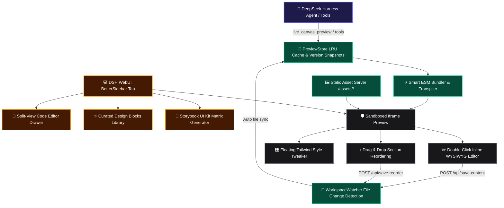

# 📦 @goodandready/dsh-live-canvas

<div align="center">

<h3>Interactive Visual Development Studio, Split-View Code Editor, Component Storybook, Drag & Drop Canvas, Curated UI Blocks, and 1-Click Vite Packager for DeepSeek Harness</h3>

<p align="center">
  <a href="https://www.npmjs.com/package/@goodandready/dsh-live-canvas"></a>
  <a href="LICENSE"></a>
  <a href="https://github.com/topics/dsh-plugin"></a>
  <a href="https://nodejs.org"></a>
</p>

<p align="center">
  <a href="https://goodandready.app/"></a>
</p>

<p align="center">
  <a href="README.md"><b>🇬🇧 English</b></a> •
  <a href="README.ru.md"><b>🇷🇺 Русский</b></a> •
  <a href="README.zh.md"><b>🇨🇳 中文说明</b></a>
</p>

</div>

---

## ⚡ Overview & The Problem

Building and iterating modern front-end interfaces inside an AI agent workspace usually suffers from several bottlenecks:
- **Blind Code Generation**: Agents write HTML/JSX code, but human developers must switch out to external bundlers or browsers to inspect the visual output.
- **Lost Context on Recompilation**: Typical reloads lose local state, component hierarchy, and responsive breakpoint context.
- **Complex Multi-File References**: Single-file previews break when React components import local child modules (`./Header.jsx`, `./theme.css`, `./data.js`) or serve local images.
- **Friction in Fine-Tuning**: Minor text tweaks or color adjustments require full conversational roundtrips with the agent instead of instant in-place visual edits.

**`dsh-live-canvas`** transforms DeepSeek Harness into a full-featured visual development studio with zero setup. It provides instant hot-reloaded canvas previews, multi-file recursive ESM bundling, an inline WYSIWYG text editor, a floating Tailwind style tweaker, a split-view code drawer, an automated Storybook matrix generator, visual Drag-and-Drop section reordering, a curated agency-level UI blocks library, and 1-click Vite project export.

---

## 🏛️ Architecture Overview



---

## ✨ Full Feature Breakdown

### 1. Multi-File ESM Bundler (`lib/transpiler.js`)
- Recursively resolves relative local imports (`./Header.jsx`, `./components/Card.tsx`, `./data.js`, `./styles.css`).
- Inlines child modules into an isolated Babel template and serves local image assets safely via `GET /dsh-live-canvas/assets/*`.

### 2. Split-View Code Editor Drawer (`lib/client.js`)
- Toggle with **`💻 Code`** button in the top toolbar.
- Provides a collapsible side-by-side monospace code editor with live syntax view.
- Bi-directional synchronization: edits in the code drawer hot-reload the canvas in real time; selecting elements in the Inspector highlights matching code sections.

### 3. Component Storybook & UI Kit Matrix (`lib/storybook.js`)
- Toggle with **`🧩 UI Kit`** button or execute agent tool `live_canvas_storybook`.
- Scans all `.jsx`, `.tsx`, and `.vue` components across the active workspace and builds a multi-variant side-by-side gallery showing component states.

### 4. Drag & Drop Visual Section Reordering (`lib/sandbox.js`)
- Toggle with **`↕️ D&D`** button in the toolbar.
- Allows intuitive dragging of `<section>`, `<header>`, `<footer>`, `<nav>`, and `.card` containers.
- Reordered DOM structure is automatically synced and persisted to disk via `POST /dsh-live-canvas/api/save-reorder`.

### 5. Curated High-End UI Blocks Library (`lib/templates.js`)
- Access via **`✨ Blocks`** modal in the toolbar or agent tool `live_canvas_insert_block`.
- Built-in library of agency-grade dark mode design blocks:
  - **Glowing Mesh Agency Hero**: Radiant gradient blur aura, badge pill, dual CTAs.
  - **Glassmorphic Bento Grid**: Asymmetric feature cards with glowing borders.
  - **SaaS 3-Tier Pricing Table**: Transparent dark cards with featured badge and checkmarks.
  - **Modern Dark FAQ Accordion**: Expandable smooth-transition question items.
  - **Minimalist Agency Footer**: Sleek dark footer with social links and system status indicator.

### 6. Inline WYSIWYG & Floating Style Tweaker (`lib/sandbox.js`)
- **Double-Click Edit**: Double-click any heading, paragraph, or label on canvas to edit text in place; hit <kbd>Enter</kbd> to persist changes to source files on disk.
- **Style Tweaker Bar**: Click elements with Inspector enabled to tweak Tailwind colors, padding, rounding, and shadow presets with instant disk sync.

### 7. Multi-Device Matrix & Visual Diff Slider
- **Responsive Breakpoints**: Instant toggle between Responsive, Mobile (375px), Tablet (768px), and Multi-Device Matrix with synchronized scrolling.
- **Visual Diff Slider**: Side-by-side comparative split slider to review regressions across version snapshots.

### 8. 1-Click Vite Project Export (`lib/packager.js`)
- Instant ZIP download or disk export of complete production-ready projects configured with `vite.config.js`, `package.json`, `tailwind.config.js`, and entrypoints.

---

## 🛠️ Complete Agent Tools Reference (17 Tools)

| Tool Name | Purpose | Output / Action |
|---|---|---|
| `live_canvas_preview` | Render or update preview session for HTML/React/SVG/Mermaid | `previewUrl`, `canvasId` |
| `live_canvas_inspect` | Retrieve user DOM clicks, CSS selectors, and attributes | `inspections: [...]` |
| `live_canvas_reload` | Force instant SSE reload on open preview windows | Hot-reload broadcast |
| `live_canvas_diagnose` | Query sandbox console errors and exceptions for self-healing | `logs: [...]`, `hasErrors` |
| `live_canvas_export` | Export standalone zero-dependency HTML bundle | `downloadUrl`, `savedPath` |
| `live_canvas_annotations` | Fetch or clear boxed visual markup and comments | `annotations: [...]` |
| `live_canvas_gallery` | Create multi-variant Storybook comparison matrix | `variantsCount`, `previewUrl` |
| `live_canvas_watch` | Scan and bind workspace files to live file watcher | `files: [...]`, `watchedFiles` |
| `live_canvas_controls` | Update Storybook-style interactive props sliders | `values: {...}` |
| `live_canvas_diff` | Visual split slider comparing two session snapshots | `diffUrl`, `snapshotCount` |
| `live_canvas_matrix` | Multi-device viewport matrix (Mobile, Tablet, Desktop) | `matrixUrl` |
| `live_canvas_mock` | Set up intercepted REST API mock routes in preview frame | `endpointsCount`, `mockData` |
| `live_canvas_pack` | 1-Click Vite+React or Vite+Vue project ZIP bundle packager | `downloadUrl`, `writtenDir` |
| `live_canvas_refine_element` | Target AI visual/structural refinement to a DOM element | Canvas hot-reload |
| `live_canvas_storybook` | Auto-scan workspace components and create UI Kit gallery | `galleryUrl`, `componentsCount` |
| `live_canvas_insert_block` | Insert curated design block (Hero, Bento, Pricing, FAQ, Footer) | `blockId`, `title` |
| `live_canvas_vision_import`| Convert image screenshot / mockup into interactive canvas | `previewUrl`, `framework` |

---

## 📦 Installation

Install into your DeepSeek Harness profile with one command:

```bash
dsh plugin --profile web add @goodandready/dsh-live-canvas
```

---

## ⚙️ Configuration (`settings.yaml`)

```yaml
plugins:
  "@goodandready/dsh-live-canvas":
    defaultViewport: "responsive" # Options: responsive, mobile, tablet, matrix
    autoOpenOnHtmlGen: true       # Auto-open Live Canvas tab upon UI generation
    enableHotReload: true         # Enable SSE hot-reload on session code updates
    maxSessionCache: 50           # Maximum active preview sessions in LRU memory
    enableFileWatcher: true       # Enable filesystem watcher for live code sync
    workspaceDir: ""              # Custom workspace directory (defaults to cwd)
```

---

## 📄 License

MIT © [GooDAnDReaDY](https://github.com/GooDAnDReaDY)

