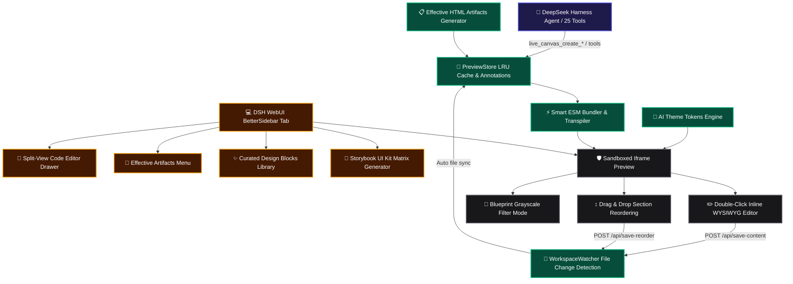

# 📦 @goodandready/dsh-live-canvas

<div align="center">

<h3>Interactive Visual Development Studio, Effective HTML Artifacts (Wireframes, Plans, Living Diagrams, Prototypes), Split-View Code Editor, Component Storybook, and 1-Click Vite Packager for DeepSeek Harness</h3>

<p align="center">
  <a href="https://www.npmjs.com/package/@goodandready/dsh-live-canvas"></a>
  <a href="LICENSE"></a>
  <a href="https://github.com/topics/dsh-plugin"></a>
  <a href="https://nodejs.org"></a>
</p>

<p align="center">
  <a href="https://goodandready.app/"></a>
</p>

<p align="center">
  <a href="README.md"><b>🇬🇧 English</b></a> •
  <a href="README.ru.md"><b>🇷🇺 Русский</b></a> •
  <a href="README.zh.md"><b>🇨🇳 中文说明</b></a>
</p>

</div>

---

## ⚡ Overview & Philosophy: "Fat Artifacts + Fat Context"

Inspired by Thariq Shihipar's *The Unreasonable Effectiveness of HTML* and Plannotator, **`dsh-live-canvas`** transforms DeepSeek Harness from a standard chat prompt interface into a rich visual workspace. Instead of returning walls of text in chat, AI agents can generate **self-contained, interactive HTML artifacts**:
- **📐 Low-Fi Wireframes**: Blueprint structural wireframes to test layout and hierarchy without visual bias.
- **📋 Interactive Plans & Roadmaps**: Living release readiness roadmaps with milestone checkboxes and persistent local state.
- **📊 Living Architecture Diagrams**: Zoomable interactive node graphs with animated data flow pulses and service inspection cards.
- **🧪 Multi-Step Prototype Flows**: Functional onboarding wizards and checkout state machines with simulated backend responses.
- **✍️ Visual Annotation Sign-Off**: Plannotator-style boxed markup with resolution threads.

---

## 🏛️ Architecture Overview



---

## ✨ Pro Studio & Effective HTML Suite Breakdown

### 1. Effective HTML Artifact Archetypes
- **Low-Fi Wireframe Engine (`lib/wireframe.js` / Tool 21)**: Monochromatic blueprint layouts with skeleton text, diagonal image boxes, and structural cards.
- **Interactive Roadmap Plan (`lib/plan.js` / Tool 22)**: Release readiness dashboards with priority tags (`P0`/`P1`/`P2`), phase milestones, and `localStorage` persistence.
- **Living Architecture Diagrams (`lib/diagram.js` / Tool 23)**: Interactive node graphs with animated data flow lines and detailed service popups.
- **Interactive Prototype Flows (`lib/prototype.js` / Tool 24)**: Multi-step wizards with transition animations, stepper pills, and state machine validation.
- **Annotation Sign-Off (`lib/store.js` / Tool 25)**: Track annotation statuses (`open` / `resolved`) and resolution comments directly on canvas.

### 2. Multi-File Recursive ESM Bundler (`lib/transpiler.js`)
- Recursively resolves relative local imports (`./Header.jsx`, `./components/Card.tsx`, `./data.js`, `./styles.css`) and safely streams local images via `GET /dsh-live-canvas/assets/*`.

### 3. Split-View Code Editor Drawer (`lib/client.js`)
- Toggle with **`💻 Code`** button in the top toolbar with bi-directional real-time debounce sync.

### 4. AI Theme Tokens Engine (`lib/themes.js`)
- 1-click design system switcher: *Linear Dark*, *Vercel Clean*, *Swiss Editorial*, *Glassmorphism Neon*, and *Cyberpunk Terminal*.

### 5. Visual Regression & Layout Audit (Tool 18: `live_canvas_visual_audit`)
- Autonomous inspection of canvas DOM for text overflow clipping, missing accessibility labels, and responsive layout issues.

### 6. Micro-Animations & Motion Playground (`lib/motion.js`)
- Visual animation studio supporting Framer Motion and zero-runtime CSS keyframe presets (*Staggered Fade-Up*, *3D Hover Tilt*, *Ambient Glow*).

### 7. Contextual Mock Data Generator (Tool 19: `live_canvas_generate_mock`)
- Zero-dependency mock data generator for users, e-commerce products, and time-series analytics.

### 8. QR Code Mobile Live Preview & Sharing (Tool 20: `live_canvas_share`)
- Instant SVG QR code and local network URL to test live responsive previews on real smartphones.

---

## 🛠️ Complete Agent Tools Reference (25 Tools)

| Tool Name | Purpose | Output / Action |
|---|---|---|
| `live_canvas_preview` | Render or update preview session for HTML/React/SVG/Mermaid | `previewUrl`, `canvasId` |
| `live_canvas_inspect` | Retrieve user DOM clicks, CSS selectors, and attributes | `inspections: [...]` |
| `live_canvas_reload` | Force instant SSE reload on open preview windows | Hot-reload broadcast |
| `live_canvas_diagnose` | Query sandbox console errors and exceptions for self-healing | `logs: [...]`, `hasErrors` |
| `live_canvas_export` | Export standalone zero-dependency HTML bundle | `downloadUrl`, `savedPath` |
| `live_canvas_annotations` | Fetch or clear boxed visual markup and comments | `annotations: [...]` |
| `live_canvas_gallery` | Create multi-variant Storybook comparison matrix | `variantsCount`, `previewUrl` |
| `live_canvas_watch` | Scan and bind workspace files to live file watcher | `files: [...]`, `watchedFiles` |
| `live_canvas_controls` | Update Storybook-style interactive props sliders | `values: {...}` |
| `live_canvas_diff` | Visual split slider comparing two session snapshots | `diffUrl`, `snapshotCount` |
| `live_canvas_matrix` | Multi-device viewport matrix (Mobile, Tablet, Desktop) | `matrixUrl` |
| `live_canvas_mock` | Set up intercepted REST API mock routes in preview frame | `endpointsCount`, `mockData` |
| `live_canvas_pack` | 1-Click Vite+React or Vite+Vue project ZIP bundle packager | `downloadUrl`, `writtenDir` |
| `live_canvas_refine_element` | Target AI visual/structural refinement to a DOM element | Canvas hot-reload |
| `live_canvas_storybook` | Auto-scan workspace components and create UI Kit gallery | `galleryUrl`, `componentsCount` |
| `live_canvas_insert_block` | Insert curated design block (Hero, Bento, Pricing, FAQ, Footer) | `blockId`, `title` |
| `live_canvas_vision_import`| Convert image screenshot / mockup into interactive canvas | `previewUrl`, `framework` |
| `live_canvas_visual_audit` | Inspect canvas DOM for overflow, contrast, and layout issues | `score`, `issuesCount`, `issues` |
| `live_canvas_generate_mock`| Generate realistic mock JSON datasets and inject into sandbox | `datasetType`, `mockData` |
| `live_canvas_share` | Generate mobile QR code and local network preview URL | `shareUrl`, `qrSvg` |
| `live_canvas_create_wireframe` | Generate low-fidelity structural HTML wireframe artifact | `previewUrl`, `layout` |
| `live_canvas_create_plan` | Generate interactive HTML project plan & release roadmap | `previewUrl`, `version` |
| `live_canvas_create_diagram` | Generate living interactive architecture diagram artifact | `previewUrl`, `diagramType` |
| `live_canvas_create_prototype` | Generate multi-step interactive prototype wizard flow | `previewUrl`, `flowType` |
| `live_canvas_resolve_annotation` | Mark visual user annotation as resolved with notes | `status: 'resolved'` |

---

## 📦 Installation

Install into your DeepSeek Harness profile with one command:

```bash
dsh plugin --profile web add @goodandready/dsh-live-canvas
```

---

## ⚙️ Configuration (`settings.yaml`)

```yaml
plugins:
  "@goodandready/dsh-live-canvas":
    defaultViewport: "responsive" # Options: responsive, mobile, tablet, matrix
    autoOpenOnHtmlGen: true       # Auto-open Live Canvas tab upon UI generation
    enableHotReload: true         # Enable SSE hot-reload on session code updates
    maxSessionCache: 50           # Maximum active preview sessions in LRU memory
    enableFileWatcher: true       # Enable filesystem watcher for live code sync
    workspaceDir: ""              # Custom workspace directory (defaults to cwd)
```

---

## 📄 License

MIT © [GooDAnDReaDY](https://github.com/GooDAnDReaDY)

