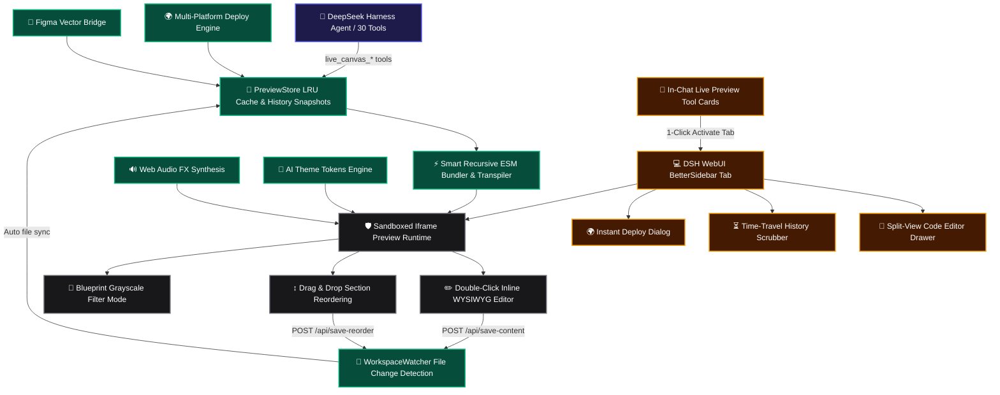

# 📦 @goodandready/dsh-live-canvas

<div align="center">

<h3>Interactive Visual Frontend Studio, Retool-Style CRUD Admin Engine, Time-Travel Debugger, 1-Click Multi-Deploy (Vercel, Cloudflare, Netlify, Gist), Figma Vector Bridge, Effective HTML Artifacts, UI Sound FX, and 30 Agent Tools for DeepSeek Harness</h3>

<p align="center">
  <a href="https://www.npmjs.com/package/@goodandready/dsh-live-canvas"></a>
  <a href="LICENSE"></a>
  <a href="https://github.com/topics/dsh-plugin"></a>
  <a href="https://nodejs.org"></a>
</p>

<p align="center">
  <a href="https://goodandready.app/"></a>
</p>

<p align="center">
  <a href="README.md"><b>🇬🇧 English</b></a> •
  <a href="README.ru.md"><b>🇷🇺 Русский</b></a> •
  <a href="README.zh.md"><b>🇨🇳 中文说明</b></a>
</p>

</div>

---

## ⚡ Overview & The Problem

When coding assistants work in standard terminal or chat windows, they typically produce static code snippets or markdown blocks. This creates critical friction:
1. **No Live Feedback**: Developers cannot see or test interactivity, form validations, animations, or responsive breakpoints without manually copying code into a local build toolchain.
2. **Context Fragmentation**: Reviewing UI changes requires switching back and forth between IDE, terminal, browser, and design tools.
3. **Verbose Text Overload**: Explaining architecture, roadmaps, and wireframes in raw text produces walls of markdown that are difficult to scan.

### The Solution: `dsh-live-canvas`
Inspired by Thariq Shihipar's *The Unreasonable Effectiveness of HTML*, Plannotator, and modern visual studios (Figma, Retool, V0), **`@goodandready/dsh-live-canvas`** transforms DeepSeek Harness into a complete, standalone frontend development suite. It provides in-memory ESM bundling, real-time SSE hot-reloading, in-chat interactive preview cards, a split-view code editor, time-travel history debugging, 1-click cloud deployment, and **30 dedicated Agent Tools**.

---

## 🏛️ System Architecture



---

## ✨ Exhaustive Feature Breakdown

### 1. 🗄️ Retool-Style CRUD Admin Dashboard Studio (`lib/crud.js` / Tool 26)
- **Instant Data Grids**: Generates full-featured data management micro-apps with live search, column sorting, and status filter pills (`Active`, `Pending`, `Suspended`).
- **Interactive Modals**: Form validation for creating and editing records on the fly.
- **Persistent Database**: Automatically syncs record changes to `localStorage` so data survives page reloads.
- **CSV Data Export**: 1-click export of table data directly to downloadable `.csv` files.

### 2. ⏳ Time-Travel Debugger & History Timeline Scrubber (`lib/timetravel.js` / Tool 27)
- **Visual Revision Slider**: Interactive scrubber bar allowing developers and agents to slide through historical session snapshots.
- **Instant Rollback**: 1-click restore of any previous snapshot directly back into the live canvas without touching Git.
- **Timestamped Revisions**: Compares intermediate iterations generated across conversation turns.

### 3. 🌍 1-Click Multi-Platform Web Deployment (`lib/deploy.js` / Tool 28)
- **Vercel**: Prepares static distribution with `vercel.json` routing rules.
- **Cloudflare Pages**: Generates `_routes.json` and security headers (`_headers`).
- **Netlify**: Packages static dist with SPA redirects (`_redirects`).
- **GitHub Gist**: Generates standalone single-file HTML ready for immediate public sharing via Gist preview.

### 4. 🎨 Figma & Penpot Vector Bridge (`lib/figma.js` / Tool 29)
- **SVG-to-Tailwind Converter**: Pasted vector SVG code from Figma or Penpot is automatically parsed into clean, responsive React JSX or HTML with Tailwind CSS classes.
- **Export to Figma**: Wraps canvas components into standard SVG with `foreignObject` for direct pasting (<kbd>Ctrl+V</kbd>) into Figma design files.

### 5. 🔊 UI Sound FX & Micro-Interactions Synthesis (`lib/sound.js` / Tool 30)
- **Zero-Dependency Web Audio API**: Pure mathematical synthesis of UI feedback sounds without external audio assets.
- **Curated Sound Presets**: Tactile `click`, switch `tap`, 2-tone `success` chime, warning `error` buzz, `modal` pop, and 3-tone `levelup` arpeggio.

### 6. 📋 Effective HTML Artifact Archetypes (`lib/wireframe.js`, `lib/plan.js`, `lib/diagram.js`, `lib/prototype.js`)
- **📐 Low-Fi Wireframes (Tool 21)**: Monochromatic blueprint layouts with skeleton loaders and placeholder image boxes to evaluate UX hierarchy without styling bias.
- **📋 Interactive Release Plans (Tool 22)**: Release readiness roadmaps with priority badges (`P0`, `P1`, `P2`), dynamic progress bars, milestone checkboxes, and persistent state.
- **📊 Living Architecture Diagrams (Tool 23)**: Zoomable node-graph diagrams with animated data flow lines and detailed service popups on click.
- **🧪 Multi-Step Prototype Flows (Tool 24)**: Onboarding wizards and checkout flows with step transitions and validation state machines.
- **✍️ Visual Annotation Sign-Off (Tool 25)**: Boxed markup with resolution statuses (`open` / `resolved`) and response threads.

### 7. 💬 In-Chat Live Preview Tool Cards (`LiveCanvasChatCard`)
- **Embedded Sandbox Preview**: Directly in the chat stream, tool executions render an interactive preview card.
- **1-Click Studio Activation**: Clicking **`🚀 Open in Live Canvas`** automatically opens the BetterSidebar Live Canvas tab and loads the session.

### 8. ⚡ Smart Multi-File ESM Bundler (`lib/transpiler.js`)
- **Recursive Local Import Resolution**: Resolves relative `./Header.jsx`, `./Card.tsx`, `./data.js`, and `./styles.css` imports in-memory.
- **Babel JSX & PostCSS**: Transpiles modern React 18, Vue, HTML5, SVG, and Mermaid diagrams without external build tools.
- **Asset Streaming**: Safely streams local workspace images via `GET /dsh-live-canvas/assets/*`.

### 9. 🎨 AI Theme Tokens Engine (`lib/themes.js`)
- 1-Click Design System Switcher: *Linear Dark*, *Vercel Clean*, *Swiss Editorial*, *Glassmorphism Neon*, and *Cyberpunk Terminal*.

### 10. 🔍 Visual Regression & Layout Audit (Tool 18)
- Inspects canvas DOM for text overflow clipping, missing `alt` attributes, low contrast, and viewport responsiveness issues.

### 11. 📱 QR Code Mobile Live Share (Tool 20)
- Generates instant SVG QR codes and local network URLs for testing canvas previews on real smartphones over Wi-Fi.

### 12. 📦 1-Click Vite Project ZIP Packager (`lib/packager.js` / Tool 13)
- Bundles the active canvas into a complete production-ready `Vite + React` or `Vite + Vue` project with `package.json`, `vite.config.js`, and `tailwind.config.js`.

---

## 🛠️ Complete 30 Agent Tools Reference

| # | Tool Name | Description | Key Parameters | Return Values |
|---|---|---|---|---|
| 1 | `live_canvas_preview` | Renders or updates preview session for HTML/React/SVG/Mermaid | `content`, `componentType`, `title`, `theme` | `previewUrl`, `canvasId`, `success` |
| 2 | `live_canvas_inspect` | Retrieves user DOM clicks, CSS selectors, and element attributes | `canvasId`, `limit` | `inspections: [...]`, `count` |
| 3 | `live_canvas_reload` | Forces instant SSE reload on open preview frames | `canvasId` | `reloaded`, `timestamp` |
| 4 | `live_canvas_diagnose` | Queries sandbox console errors and exceptions for self-healing | `canvasId`, `level` | `logs: [...]`, `hasErrors` |
| 5 | `live_canvas_export` | Exports standalone zero-dependency HTML bundle | `canvasId`, `saveToDisk` | `downloadUrl`, `savedPath` |
| 6 | `live_canvas_annotations` | Queries or clears boxed visual annotations and user markup | `canvasId`, `action` | `annotations: [...]`, `count` |
| 7 | `live_canvas_gallery` | Creates multi-variant Storybook comparison matrix | `variants`, `title` | `variantsCount`, `previewUrl` |
| 8 | `live_canvas_watch` | Scans and binds workspace files to live file watcher | `subDir`, `exts` | `files: [...]`, `watchedFiles` |
| 9 | `live_canvas_controls` | Updates Storybook-style interactive props sliders | `canvasId`, `values`, `schema` | `values: {...}`, `schema: {...}` |
| 10 | `live_canvas_diff` | Visual split slider comparing two session snapshots | `canvasId`, `fromId`, `toId` | `diffUrl`, `snapshotCount` |
| 11 | `live_canvas_matrix` | Multi-device viewport matrix (Mobile, Tablet, Desktop) | `canvasId` | `matrixUrl` |
| 12 | `live_canvas_mock` | Configures intercepted REST API mock routes in preview frame | `canvasId`, `endpoints` | `endpointsCount`, `mockData` |
| 13 | `live_canvas_pack` | 1-Click Vite+React or Vite+Vue project ZIP bundle packager | `canvasId`, `framework` | `downloadUrl`, `writtenDir` |
| 14 | `live_canvas_refine_element` | Targets AI visual/structural refinement to a DOM element | `canvasId`, `selector`, `prompt` | `success`, `message` |
| 15 | `live_canvas_storybook` | Auto-scans workspace components and creates UI Kit gallery | `subDir`, `framework` | `galleryUrl`, `componentsCount` |
| 16 | `live_canvas_insert_block` | Inserts curated design block (Hero, Bento, Pricing, FAQ, Footer) | `blockId`, `canvasId` | `blockId`, `title` |
| 17 | `live_canvas_vision_import` | Converts image mockup/screenshot into interactive canvas | `imagePath`, `framework` | `previewUrl`, `framework` |
| 18 | `live_canvas_visual_audit` | Inspects canvas DOM for overflow, contrast, and layout issues | `canvasId` | `score`, `issuesCount`, `issues` |
| 19 | `live_canvas_generate_mock` | Generates realistic mock JSON datasets and injects into sandbox | `type`, `count`, `canvasId` | `datasetType`, `mockData` |
| 20 | `live_canvas_share` | Generates mobile QR code and local network preview URL | `canvasId` | `shareUrl`, `qrSvg` |
| 21 | `live_canvas_create_wireframe` | Generates low-fidelity structural HTML wireframe artifact | `title`, `layout`, `canvasId` | `previewUrl`, `layout` |
| 22 | `live_canvas_create_plan` | Generates interactive HTML project plan & release roadmap | `title`, `version`, `canvasId` | `previewUrl`, `version` |
| 23 | `live_canvas_create_diagram` | Generates living interactive architecture diagram artifact | `title`, `diagramType`, `canvasId` | `previewUrl`, `diagramType` |
| 24 | `live_canvas_create_prototype` | Generates multi-step interactive prototype wizard flow | `title`, `flowType`, `canvasId` | `previewUrl`, `flowType` |
| 25 | `live_canvas_resolve_annotation` | Marks visual user annotation as resolved with notes | `canvasId`, `annotationId`, `note` | `status: 'resolved'` |
| 26 | `live_canvas_create_crud` | Generates Retool-style admin CRUD dashboard with table and modals | `title`, `entityName`, `canvasId` | `previewUrl`, `entityName` |
| 27 | `live_canvas_timetravel` | Steps through snapshot history timeline or restores revisions | `canvasId`, `action`, `snapshotIndex`| `timetravelUrl`, `snapshotsCount` |
| 28 | `live_canvas_instant_deploy` | Generates ready-to-ship bundle for Vercel, Cloudflare, Netlify, Gist | `canvasId`, `target` | `downloadUrl`, `instructions` |
| 29 | `live_canvas_figma_bridge` | Converts Figma SVG vector code to Tailwind or exports component SVG | `svg`, `action`, `canvasId` | `action`, `componentName` |
| 30 | `live_canvas_sound_fx` | Synthesizes and previews Web Audio UI feedback sounds | `action`, `soundType` | `presetsCount`, `soundType` |

---

## 📦 Installation

Install into your DeepSeek Harness profile with one command:

```bash
dsh plugin --profile web add @goodandready/dsh-live-canvas
```

---

## ⚙️ Configuration (`settings.yaml`)

```yaml
plugins:
  "@goodandready/dsh-live-canvas":
    defaultViewport: "responsive" # Options: responsive, mobile, tablet, desktop, matrix
    autoOpenOnHtmlGen: true       # Automatically focus Live Canvas tab upon UI generation
    enableHotReload: true         # Enable SSE real-time hot-reloading on code updates
    maxSessionCache: 50           # Maximum active preview sessions in LRU memory cache
    enableFileWatcher: true       # Enable filesystem watcher for live project sync
    workspaceDir: ""              # Custom project root path (defaults to working directory)
```

| Parameter | Type | Default | Description |
|---|---|---|---|
| `defaultViewport` | `string` | `"responsive"` | Initial viewport dimension (`responsive`, `mobile`, `tablet`, `desktop`, `matrix`) |
| `autoOpenOnHtmlGen` | `boolean` | `true` | Automatically opens BetterSidebar Live Canvas tab when agent generates UI |
| `enableHotReload` | `boolean` | `true` | Real-time SSE hot-reload stream for sandbox frames |
| `maxSessionCache` | `number` | `50` | Maximum number of active preview sessions kept in memory |
| `enableFileWatcher` | `boolean` | `true` | Monitors workspace directory for file changes |
| `workspaceDir` | `string` | `""` | Base directory for scanning workspace components |

---

## ⌨️ Interactive Controls & Shortcuts

| Action | Shortcut / Trigger | Result |
|---|---|---|
| **Inline WYSIWYG Text Edit** | Double-click text element on canvas | Edit heading/paragraph inline and save with <kbd>Enter</kbd> |
| **Split-View Code Editor** | Click **`💻 Code`** in toolbar | Collapsible side-by-side code editor with live debounce sync |
| **Blueprint Mode** | Click **`📐 Wireframe`** in toolbar | Toggles high-contrast monochromatic structural view |
| **Drag & Drop Reordering** | Click **`↕️ D&D`** in toolbar | Drag section and card blocks to reorder layout visually |
| **Time-Travel Scrubber** | Click **`⏳ Timeline`** in toolbar | Slide through revision history and restore previous snapshots |
| **1-Click Web Deploy** | Click **`🌍 Deploy`** in toolbar | Prepares Vercel, Cloudflare, Netlify, or Gist deployment package |
| **Sound FX Toggle** | Click **`🔊 Sound`** in toolbar | Enables/disables synthesized Web Audio feedback |
| **Inspect Element** | Click **`🔍 Inspect`** in toolbar | Click any DOM element to capture CSS selector and computed styles |
| **Visual Annotations** | Click **`🖍 Annotate`** in toolbar | Draw bounding boxes and leave review comments for the agent |

---

## 📄 License

MIT © [GooDAnDReaDY](https://github.com/GooDAnDReaDY)

