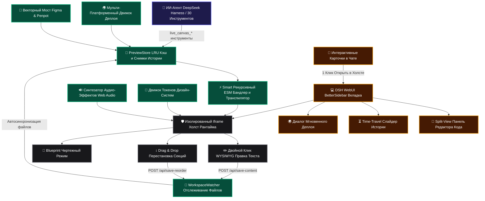

# 📦 @goodandready/dsh-live-canvas

<div align="center">

<h3>Интерактивная дизайн-студия, Retool-подобная CRUD фабрика, Time-Travel отладчик, мгновенный деплой (Vercel, Cloudflare, Netlify, Gist), Figma Vector Bridge, Effective HTML артефакты, саунд-дизайн и 30 инструментов агента для DeepSeek Harness</h3>

<p align="center">
  <a href="https://www.npmjs.com/package/@goodandready/dsh-live-canvas"></a>
  <a href="LICENSE"></a>
  <a href="https://github.com/topics/dsh-plugin"></a>
  <a href="https://nodejs.org"></a>
</p>

<p align="center">
  <a href="https://goodandready.app/"></a>
</p>

<p align="center">
  <a href="README.md"><b>🇬🇧 English</b></a> •
  <a href="README.ru.md"><b>🇷🇺 Русский</b></a> •
  <a href="README.zh.md"><b>🇨🇳 中文说明</b></a>
</p>

</div>

---

## ⚡ Обзор и решаемая проблема

Когда ИИ-ассистент работает в стандартном текстовом чате или консоли, он возвращает статичные фрагменты кода или markdown-блоки. Это порождает критические трудности:
1. **Отсутствие мгновенной обратной связи**: Разработчик не может сразу увидеть адаптивность, проверить кликабельность кнопок, валидацию форм или анимации без ручного копирования кода в локальный проект.
2. **Разрыв контекста**: Для ревью интерфейса приходится переключаться между IDE, терминалом, браузером и графическими редакторами.
3. **Перегрузка текстом**: Описание архитектуры, планов релиза и структурных макетов в виде сырого текста приводит к простыням markdown, которые трудно воспринимать.

### Решение: `dsh-live-canvas`
Вдохновленный манифестом *The Unreasonable Effectiveness of HTML*, Plannotator и современными визуальными средами (Figma, Retool, V0), плагин **`@goodandready/dsh-live-canvas`** превращает DeepSeek Harness в автономную frontend-студию. Он предоставляет in-memory ESM-бандлер, горячую перезагрузку по SSE, интерактивные карточки предпросмотра прямо в чате, Split-View редактор кода, машину времени для отката ревизий, 1-click деплой в облака и **30 инструментов агента**.

---

## 🏛️ Архитектура системы



---

## ✨ Полный разбор возможностей

### 1. 🗄️ Retool-Style CRUD Admin Dashboard Studio (`lib/crud.js` / Tool 26)
- **Готовые таблицы управления данными**: генерация панелей администрирования с поиском, сортировкой колонок и бейджами статусов (`Active`, `Pending`, `Suspended`).
- **Интерактивные модальные окна**: создание и редактирование записей с валидацией полей.
- **Полноценная база данных в браузере**: автосохранение всех изменений в `localStorage` (данные сохраняются при перезагрузках страницы).
- **Экспорт в CSV**: скачивание таблицы в файл `.csv` в один клик.

### 2. ⏳ Time-Travel Debugger & Слайдер истории изменений (`lib/timetravel.js` / Tool 27)
- **Визуальный таймлайн-слайдер**: пошаговое перемещение по промежуточным версиям верстки прямо в браузере.
- **Откат в 1 клик**: мгновенное восстановление любого снимка ревизии в активный холст без возни с Git.
- **Сравнение итераций**: фиксация каждого шага генерации и правки агента.

### 3. 🌍 Мгновенный мульти-платформенный деплой (`lib/deploy.js` / Tool 28)
- **Vercel**: формирование статического пакета с конфигурацией маршрутизации `vercel.json`.
- **Cloudflare Pages**: генерация директивы `_routes.json` и заголовков безопасности `_headers`.
- **Netlify**: сборка дистрибутива со SPA-перенаправлениями `_redirects`.
- **GitHub Gist**: экспорт монолитного HTML для мгновенной публичной ссылки через Gist Preview.

### 4. 🎨 Векторный мост Figma & Penpot (`lib/figma.js` / Tool 29)
- **Конвертер SVG в Tailwind**: вставка скопированного из Figma векторного SVG кода автоматически трансформируется в чистый адаптивный React JSX или HTML с классами Tailwind CSS.
- **Экспорт в Figma**: генерация совместимого SVG с `foreignObject` для прямой вставки (<kbd>Ctrl+V</kbd>) любого компонента в макет Figma.

### 5. 🔊 Саунд-дизайн и тактильные микро-звуки (`lib/sound.js` / Tool 30)
- **Web Audio API без зависимостей**: чистый программный синтез частот без внешних MP3/WAV файлов.
- **Пресеты микро-звуков**: тактильный клик (`click`), переключатель (`tap`), 2-тоновый аккорд успеха (`success`), предупреждающий зуммер (`error`), всплывающее окно (`modal`) и 3-тоновое арпеджио (`levelup`).

### 6. 📋 Набор Effective HTML артефактов (`lib/wireframe.js`, `lib/plan.js`, `lib/diagram.js`, `lib/prototype.js`)
- **📐 Low-Fi Вайрфреймы (Tool 21)**: монохромные макеты со скелетонами и плейсхолдерами для оценки структуры и UX без отвлечения на цвета.
- **📋 Интерактивные Роадмапы (Tool 22)**: чекбоксы этапов, приоритеты (`P0`, `P1`, `P2`), динамический прогресс-бар и автосохранение статусов в `localStorage`.
- **📊 Живые Архитектурные Схемы (Tool 23)**: масштабируемые графы сервисов со светящимися анимированными потоками данных и карточкой инспекции по клику.
- **🧪 Многошаговые Прототипы (Tool 24)**: визарды регистрации и оформления заказа с плавной анимацией шагов и стейт-машиной.
- **✍️ Резолюция визуальных правок (Tool 25)**: фиксация замечаний со статусами («Решено / В работе») прямо на холсте.

### 7. 💬 Интерактивные карточки в сообщениях чата (`LiveCanvasChatCard`)
- **Живой фрейм прямо в чате**: результат работы инструментов отображается интерактивной карточкой с работающим интерфейсом.
- **Кнопка `🚀 Открыть в Live Canvas`**: в 1 клик открывает боковую панель BetterSidebar и загружает проект в полноразмерную студию.

### 8. ⚡ Многофайловый рекурсивный ESM-бандлер (`lib/transpiler.js`)
- **Рекурсивные локальные импорты**: сборка относительных путей (`./Header.jsx`, `./Card.tsx`, `./data.js`, `./styles.css`) на лету в оперативной памяти.
- **Babel JSX и PostCSS**: транспиляция React 18, Vue, HTML5, SVG и Mermaid без внешних сборщиков.
- **Раздача статических ассетов**: безопасный стриминг локальных картинок проекта через `GET /dsh-live-canvas/assets/*`.

### 9. 🎨 Движок токенов дизайн-систем (`lib/themes.js`)
- Переключение дизайн-систем в 1 клик: *Linear Dark*, *Vercel Clean*, *Swiss Editorial*, *Glassmorphism Neon*, *Cyberpunk Terminal*.

### 10. 🔍 Автономный визуальный аудит верстки (Tool 18)
- Проверка DOM на вылезающий текст, нарушения контрастности WCAG и проблемы адаптивности с выдачей оценки от 0 до 100.

### 11. 📱 Мобильное тестирование по QR-коду (Tool 20)
- Генерация QR-кода и локального IP-адреса для мгновенного тестирования верстки на реальном смартфоне по Wi-Fi.

### 12. 📦 Экспорт в Vite проект в 1 клик (`lib/packager.js` / Tool 13)
- Упаковка открытого холста в готовый ZIP-архив `Vite + React` или `Vite + Vue` с `package.json`, `vite.config.js` и `tailwind.config.js`.

---

## 🛠️ Справочник всех 30 инструментов агента

| # | Имя инструмента | Назначение | Параметры | Результат / Действие |
|---|---|---|---|---|
| 1 | `live_canvas_preview` | Создание или обновление превью HTML/React/SVG/Mermaid | `content`, `componentType`, `title`, `theme` | `previewUrl`, `canvasId`, `success` |
| 2 | `live_canvas_inspect` | Получение кликов пользователя, селекторов и стилей | `canvasId`, `limit` | `inspections: [...]`, `count` |
| 3 | `live_canvas_reload` | Принудительная горячая перезагрузка открытых холстов | `canvasId` | `reloaded`, `timestamp` |
| 4 | `live_canvas_diagnose` | Запрос логов ошибок и исключений консоли | `canvasId`, `level` | `logs: [...]`, `hasErrors` |
| 5 | `live_canvas_export` | Экспорт автономного монолитного HTML-файла | `canvasId`, `saveToDisk` | `downloadUrl`, `savedPath` |
| 6 | `live_canvas_annotations` | Чтение или очистка графических пометок и замечаний | `canvasId`, `action` | `annotations: [...]`, `count` |
| 7 | `live_canvas_gallery` | Создание матрицы состояний компонентов Storybook | `variants`, `title` | `variantsCount`, `previewUrl` |
| 8 | `live_canvas_watch` | Сканирование и привязка файлов проекта к наблюдателю | `subDir`, `exts` | `files: [...]`, `watchedFiles` |
| 9 | `live_canvas_controls` | Управление интерактивными слайдерами и пропсами | `canvasId`, `values`, `schema` | `values: {...}`, `schema: {...}` |
| 10 | `live_canvas_diff` | Визуальный сплит-слайдер сравнения двух версий | `canvasId`, `fromId`, `toId` | `diffUrl`, `snapshotCount` |
| 11 | `live_canvas_matrix` | Мульти-экранная матрица разрешений (Mobile, Tablet, Desktop) | `canvasId` | `matrixUrl` |
| 12 | `live_canvas_mock` | Настройка перехватываемых мок-ответов REST API | `canvasId`, `endpoints` | `endpointsCount`, `mockData` |
| 13 | `live_canvas_pack` | Сборка готового Vite+React / Vite+Vue проекта в ZIP | `canvasId`, `framework` | `downloadUrl`, `writtenDir` |
| 14 | `live_canvas_refine_element` | Точечная визуальная или структурная ИИ-правка элемента | `canvasId`, `selector`, `prompt` | `success`, `message` |
| 15 | `live_canvas_storybook` | Автосканирование компонентов и создание Storybook галереи | `subDir`, `framework` | `galleryUrl`, `componentsCount` |
| 16 | `live_canvas_insert_block` | Вставка дизайн-блока (Hero, Bento, Pricing, FAQ, Footer) | `blockId`, `canvasId` | `blockId`, `title` |
| 17 | `live_canvas_vision_import` | Импорт скриншота / макета в интерактивный код | `imagePath`, `framework` | `previewUrl`, `framework` |
| 18 | `live_canvas_visual_audit` | Аудит DOM на переполнение, контрастность и адаптивность | `canvasId` | `score`, `issuesCount`, `issues` |
| 19 | `live_canvas_generate_mock` | Генерация реалистичных JSON мок-данных в песочницу | `type`, `count`, `canvasId` | `datasetType`, `mockData` |
| 20 | `live_canvas_share` | Генерация QR-кода и локального URL для смартфона | `canvasId` | `shareUrl`, `qrSvg` |
| 21 | `live_canvas_create_wireframe` | Генерация Low-Fi структурного чертежа вайрфрейма | `title`, `layout`, `canvasId` | `previewUrl`, `layout` |
| 22 | `live_canvas_create_plan` | Генерация интерактивного роадмапа и плана релиза | `title`, `version`, `canvasId` | `previewUrl`, `version` |
| 23 | `live_canvas_create_diagram` | Генерация живой схемы архитектуры с анимацией потоков | `title`, `diagramType`, `canvasId` | `previewUrl`, `diagramType` |
| 24 | `live_canvas_create_prototype` | Генерация многошагового интерактивного прототипа | `title`, `flowType`, `canvasId` | `previewUrl`, `flowType` |
| 25 | `live_canvas_resolve_annotation` | Пометка замечания как решенного с фиксацией ответа | `canvasId`, `annotationId`, `note` | `status: 'resolved'` |
| 26 | `live_canvas_create_crud` | Генерация Retool-style CRUD админ-панели с таблицей | `title`, `entityName`, `canvasId` | `previewUrl`, `entityName` |
| 27 | `live_canvas_timetravel` | Пошаговый просмотр истории ревизий и откат | `canvasId`, `action`, `snapshotIndex`| `timetravelUrl`, `snapshotsCount` |
| 28 | `live_canvas_instant_deploy` | Формирование пакета деплоя (Vercel, Cloudflare, Netlify, Gist) | `canvasId`, `target` | `downloadUrl`, `instructions` |
| 29 | `live_canvas_figma_bridge` | Конвертация SVG Figma в Tailwind или экспорт в SVG | `svg`, `action`, `canvasId` | `action`, `componentName` |
| 30 | `live_canvas_sound_fx` | Синтез и воспроизведение тактильных микро-звуков UI | `action`, `soundType` | `presetsCount`, `soundType` |

---

## 📦 Быстрая установка

Установка в профиль DeepSeek Harness одной командой:

```bash
dsh plugin --profile web add @goodandready/dsh-live-canvas
```

---

## ⚙️ Полная таблица конфигурации (`settings.yaml`)

```yaml
plugins:
  "@goodandready/dsh-live-canvas":
    defaultViewport: "responsive" # Варианты: responsive, mobile, tablet, desktop, matrix
    autoOpenOnHtmlGen: true       # Автооткрытие вкладки Live Canvas при генерации верстки
    enableHotReload: true         # SSE горячая перезагрузка при обновлении кода
    maxSessionCache: 50           # Максимум активных сессий предпросмотра в LRU кэше
    enableFileWatcher: true       # Включение наблюдателя файлов рабочей директории
    workspaceDir: ""              # Кастомный путь к проекту (по умолчанию — текущий)
```

| Параметр | Тип | По умолчанию | Описание |
|---|---|---|---|
| `defaultViewport` | `string` | `"responsive"` | Начальное разрешение холста (`responsive`, `mobile`, `tablet`, `desktop`, `matrix`) |
| `autoOpenOnHtmlGen` | `boolean` | `true` | Автоматически открывает вкладку в BetterSidebar при создании верстки агентом |
| `enableHotReload` | `boolean` | `true` | Включает real-time SSE поток горячей перезагрузки холста |
| `maxSessionCache` | `number` | `50` | Максимальное количество активных сессий в LRU оперативной памяти |
| `enableFileWatcher` | `boolean` | `true` | Автоматически отслеживает изменения файлов в рабочей директории |
| `workspaceDir` | `string` | `""` | Базовая папка для сканирования компонентов (по умолчанию — текущая) |

---

## ⌨️ Интерактивное управление и горячие клавиши

| Действие | Триггер / Кнопка | Результат |
|---|---|---|
| **WYSIWYG правка текста** | Двойной клик по тексту на холсте | Прямое редактирование заголовка и сохранение по <kbd>Enter</kbd> |
| **Split-View редактор кода** | Кнопка **`💻 Код`** в тулбаре | Выдвигает редактор кода с двусторонней синхронизацией на лету |
| **Режим чертежа (Blueprint)** | Кнопка **`📐 Вайрфрейм`** в тулбаре | Включает высококонтрастный монохромный фильтр холста |
| **Перестановка блоков (D&D)** | Кнопка **`↕️ D&D`** в тулбаре | Перетаскивание секций и карточек мышкой с сохранением порядка |
| **Машина времени (Time-Travel)**| Кнопка **`⏳ Таймлайн`** в тулбаре | Прокрутка истории ревизий и восстановление любого снимка |
| **Мгновенный деплой** | Кнопка **`🌍 Деплой`** в тулбаре | Подготовка пакета для Vercel, Cloudflare, Netlify или Gist |
| **Управление звуком** | Кнопка **`🔊 Звук`** в тулбаре | Включение/выключение Web Audio синтезатора звуков UI |
| **Инспектор элементов** | Кнопка **`🔍 Инспектор`** в тулбаре | Клик по любому элементу DOM для получения селектора и стилей |
| **Графические аннотации** | Кнопка **`🖍 Аннотации`** в тулбаре | Рисование прямоугольных рамок с комментариями для агента |

---

## 📄 Лицензия

MIT © [GooDAnDReaDY](https://github.com/GooDAnDReaDY)

