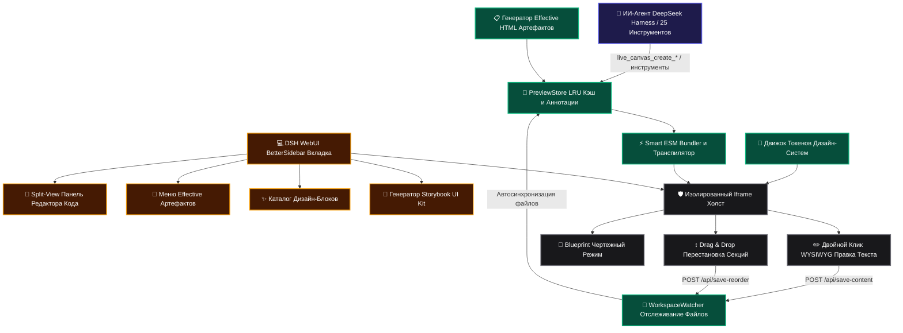

# 📦 @goodandready/dsh-live-canvas

<div align="center">

<h3>Интерактивная дизайн-студия, Effective HTML артефакты (вайрфреймы, роадмапы, живые диаграммы, прототипы), Split-View редактор кода, Storybook UI Kit и экспорт в Vite для DeepSeek Harness</h3>

<p align="center">
  <a href="https://www.npmjs.com/package/@goodandready/dsh-live-canvas"></a>
  <a href="LICENSE"></a>
  <a href="https://github.com/topics/dsh-plugin"></a>
  <a href="https://nodejs.org"></a>
</p>

<p align="center">
  <a href="https://goodandready.app/"></a>
</p>

<p align="center">
  <a href="README.md"><b>🇬🇧 English</b></a> •
  <a href="README.ru.md"><b>🇷🇺 Русский</b></a> •
  <a href="README.zh.md"><b>🇨🇳 中文说明</b></a>
</p>

</div>

---

## ⚡ Философия «Fat Artifacts + Fat Context»

Вдохновленный манифестом *The Unreasonable Effectiveness of HTML* и Plannotator, **`dsh-live-canvas`** превращает DeepSeek Harness из простого текстового чата в богатую визуальную дизайн-среду. Вместо громоздких простыней текста агент генерирует **самодостаточные интерактивные HTML-артефакты**:
- **📐 Low-Fi Вайрфреймы**: Монохромные чертежи со скелетонами для тестирования структуры, информационной иерархии и UX без отвлечения на дизайн.
- **📋 Интерактивные Роадмапы и Планы**: Живые панели готовности релиза с чекбоксами задач, приоритетами (`P0`/`P1`/`P2`) и сохранением состояния в `localStorage`.
- **📊 Живые Архитектурные Диаграммы**: Интерактивные схемы с зумом, перетаскиванием узлов, анимацией потоков данных и карточками инспекции сервисов.
- **🧪 Многошаговые Прототипы**: Рабочие визарды онбординга, формы авторизации и оформление заказа с переходами и симуляцией стейт-машины.
- **✍️ Резолюция визуальных правок**: Фиксация статусов замечаний («Решено / В работе») прямо на холсте.

---

## 🏛️ Архитектура системы



---

## ✨ Pro Studio & Effective HTML Suite

### 1. Архетипы интерактивных HTML-артефактов
- **Low-Fi Вайрфреймы (`lib/wireframe.js` / Tool 21)**: Монохромные макеты со скелетон-текстом, диагональными блоками картинок и карточками.
- **Интерактивные Роадмапы (`lib/plan.js` / Tool 22)**: Панели прогресса с приоритетами (`P0`/`P1`/`P2`), чекбоксами и автосохранением в `localStorage`.
- **Живые Архитектурные Схемы (`lib/diagram.js` / Tool 23)**: Интерактивные графы узлов с анимацией потоков данных и инспектором сервисов.
- **Многошаговые Прототипы (`lib/prototype.js` / Tool 24)**: Интерактивные визарды с плавной анимацией шагов и валидацией форм.
- **Резолюция Аннотаций (`lib/store.js` / Tool 25)**: Управление статусами правок (`open` / `resolved`) с фиксацией ответа агента.

### 2. Многофайловый рекурсивный ESM-бандлер (`lib/transpiler.js`)
- Автопоиск и сборка локальных импортов (`.jsx`, `.tsx`, `.vue`, `.css`) и безопасная раздача ассетов через `GET /dsh-live-canvas/assets/*`.

### 3. Split-View редактор кода (`lib/client.js`)
- Выдвижная панель моноширинного редактора с двусторонней синхронизацией в реальном времени.

### 4. AI Theme Tokens Engine (`lib/themes.js`)
- Переключение дизайн-систем в 1 клик: *Linear Dark*, *Vercel Clean*, *Swiss Editorial*, *Glassmorphism Neon*, *Cyberpunk Terminal*.

### 5. Автономный аудит верстки (Tool 18: `live_canvas_visual_audit`)
- Проверка DOM на вылезающий текст, нарушения контрастности WCAG и проблемы с адаптивностью.

### 6. Студия микро-анимаций (`lib/motion.js`)
- Пресеты пружинной анимации и кейфреймов (*Staggered Fade-Up*, *3D Hover Tilt*, *Ambient Glow*).

### 7. Генератор мок-данных (Tool 19: `live_canvas_generate_mock`)
- Заполнение таблиц, карточек и графиков моками (*Пользователи*, *Товары E-Commerce*, *Аналитика*).

### 8. Мобильное тестирование по QR-коду (Tool 20: `live_canvas_share`)
- Генерация QR-кода для мгновенного открытия верстки на смартфоне по Wi-Fi.

---

## 🛠️ Справочник инструментов агента (25 инструментов)

| Имя инструмента | Назначение | Результат / Действие |
|---|---|---|
| `live_canvas_preview` | Создание или обновление сессии превью HTML/React/SVG/Mermaid | `previewUrl`, `canvasId` |
| `live_canvas_inspect` | Получение кликов пользователя, CSS-селекторов и атрибутов элементов | `inspections: [...]` |
| `live_canvas_reload` | Принудительная горячая перезагрузка открытых окон предпросмотра | SSE Broadcast |
| `live_canvas_diagnose` | Запрос ошибок консоли и исключений рантайма для самолечения | `logs: [...]`, `hasErrors` |
| `live_canvas_export` | Экспорт автономного HTML-файла без зависимостей | `downloadUrl`, `savedPath` |
| `live_canvas_annotations` | Чтение или очистка графических пометок и комментариев | `annotations: [...]` |
| `live_canvas_gallery` | Создание мульти-вариантной матрицы состояний Storybook | `variantsCount`, `previewUrl` |
| `live_canvas_watch` | Сканирование и привязка файлов проекта к файловому наблюдателю | `files: [...]`, `watchedFiles` |
| `live_canvas_controls` | Управление интерактивными слайдерами и пропсами | `values: {...}` |
| `live_canvas_diff` | Визуальный сплит-слайдер сравнения двух версий дизайна | `diffUrl`, `snapshotCount` |
| `live_canvas_matrix` | Мульти-экранная матрица разрешений (Mobile, Tablet, Desktop) | `matrixUrl` |
| `live_canvas_mock` | Настройка мок-ответов REST API, перехватываемых песочницей | `endpointsCount`, `mockData` |
| `live_canvas_pack` | Сборка готового Vite+React / Vite+Vue проекта в ZIP | `downloadUrl`, `writtenDir` |
| `live_canvas_refine_element` | Точечная визуальная или структурная ИИ-правка выбранного DOM-элемента | Hot-reload холста |
| `live_canvas_storybook` | Автосканирование компонентов и создание Storybook UI Kit галереи | `galleryUrl`, `componentsCount` |
| `live_canvas_insert_block` | Вставка дизайн-блока (Hero, Bento, Pricing, FAQ, Footer) в проект | `blockId`, `title` |
| `live_canvas_vision_import`| Импорт скриншота / макета в живой интерактивный код | `previewUrl`, `framework` |
| `live_canvas_visual_audit` | Анализ DOM на переполнение, контрастность и адаптивность | `score`, `issuesCount`, `issues` |
| `live_canvas_generate_mock`| Генерация реалистичных JSON мок-данных и внедрение в песочницу | `datasetType`, `mockData` |
| `live_canvas_share` | Генерация QR-кода и локального URL для смартфона | `shareUrl`, `qrSvg` |
| `live_canvas_create_wireframe` | Генерация Low-Fi структурного чертежа вайрфрейма | `previewUrl`, `layout` |
| `live_canvas_create_plan` | Генерация интерактивного роадмапа проекта и плана релиза | `previewUrl`, `version` |
| `live_canvas_create_diagram` | Генерация живой интерактивной схемы архитектуры и потоков данных | `previewUrl`, `diagramType` |
| `live_canvas_create_prototype` | Генерация многошагового интерактивного прототипа (визарда) | `previewUrl`, `flowType` |
| `live_canvas_resolve_annotation` | Пометка визуального замечания как решенного с фиксацией ответа | `status: 'resolved'` |

---

## 📦 Быстрая установка

Установка в профиль DeepSeek Harness одной командой:

```bash
dsh plugin --profile web add @goodandready/dsh-live-canvas
```

---

## ⚙️ Конфигурация (`settings.yaml`)

```yaml
plugins:
  "@goodandready/dsh-live-canvas":
    defaultViewport: "responsive" # Варианты: responsive, mobile, tablet, matrix
    autoOpenOnHtmlGen: true       # Автооткрытие вкладки Live Canvas при генерации верстки
    enableHotReload: true         # SSE горячая перезагрузка при обновлении кода
    maxSessionCache: 50           # Максимум сессий превью в LRU кэше
    enableFileWatcher: true       # Включение наблюдателя файлов рабочей директории
    workspaceDir: ""              # Кастомный путь к проекту (по умолчанию — текущий)
```

---

## 📄 Лицензия

MIT © [GooDAnDReaDY](https://github.com/GooDAnDReaDY)

