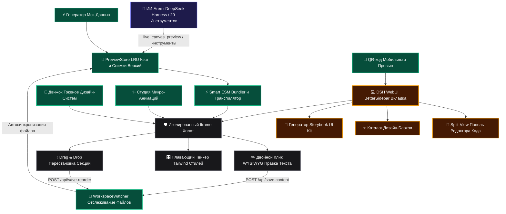

# 📦 @goodandready/dsh-live-canvas

<div align="center">

<h3>Интерактивная дизайн-студия, Split-View редактор кода, Storybook UI Kit, студия анимаций, генератор мок-данных, AI-темы и экспорт в Vite для DeepSeek Harness</h3>

<p align="center">
  <a href="https://www.npmjs.com/package/@goodandready/dsh-live-canvas"></a>
  <a href="LICENSE"></a>
  <a href="https://github.com/topics/dsh-plugin"></a>
  <a href="https://nodejs.org"></a>
</p>

<p align="center">
  <a href="https://goodandready.app/"></a>
</p>

<p align="center">
  <a href="README.md"><b>🇬🇧 English</b></a> •
  <a href="README.ru.md"><b>🇷🇺 Русский</b></a> •
  <a href="README.zh.md"><b>🇨🇳 中文说明</b></a>
</p>

</div>

---

## ⚡ Обзор и решаемая проблема

Разработка и отладка интерфейсов в среде ИИ-агентов традиционно сопряжена с рядом проблем:
- **Генерация «вслепую»**: агент генерирует код верстки или компонентов, но человеку приходится вручную запускать внешние сборщики, чтобы оценить результат.
- **Потеря контекста при перезагрузке**: сброс состояния React-хуков и точек адаптивности.
- **Многофайловые зависимости**: компоненты часто импортируют дочерние модули (`./Header.jsx`, `./theme.css`, `./data.js`) и локальные картинки.
- **Высокая стоимость мелких правок**: изменить тему, анимацию или текст требует нового полного запроса к модели.

**`dsh-live-canvas`** превращает DeepSeek Harness в полноценную визуальную фронтенд-студию и дизайн-комбайн. Плагин предоставляет моментальный рендеринг HTML5/React с горячей перезагрузкой, рекурсивный ESM-бандлер, встроенный WYSIWYG-редактор текста, плавающий твикер Tailwind-стилей, Split-View редактор кода, автоматический Storybook UI Kit, Drag-and-Drop перетаскивание секций, движок тем и токенов, студию анимаций, генератор контекстных мок-данных, QR-код для мобильного тестирования и экспорт в Vite проект в 1 клик.

---

## 🏛️ Архитектура системы



---

## ✨ Pro Studio возможности

### 1. Многофайловый рекурсивный ESM-бандлер (`lib/transpiler.js`)
- Автоматически находит и подтягивает локальные импорты (`./Header.jsx`, `./components/Card.tsx`, `./data.js`, `./styles.css`).
- Встраивает дочерние компоненты в изолированный Babel-шаблон и безопасно раздает локальные изображения через `GET /dsh-live-canvas/assets/*`.

### 2. Выдвижная панель редактора кода Split-View (`lib/client.js`)
- Открывается по кнопке **`💻 Код`** в тулбаре с подсветкой и моноширинным редактором.
- Двусторонняя синхронизация: правки в коде на лету обновляют холст и исходный файл.

### 3. AI Theme Tokens Engine (`lib/themes.js`)
- Переключение дизайн-систем в 1 клик: *Linear Dark*, *Vercel Clean*, *Swiss Editorial*, *Glassmorphism Neon*, *Cyberpunk Terminal*.
- Автогенерация CSS-переменных и готовых токенов `tailwind.config.js`.

### 4. Автономный аудит верстки и контрастности (Tool 18: `live_canvas_visual_audit`)
- Инспекция DOM на предмет вылезающего за границы текста, нарушений контрастности WCAG и проблем с мобильной адаптивностью.

### 5. Студия микро-анимаций (`lib/motion.js`)
- Готовые пресеты анимаций и кейфреймов (*Staggered Fade-Up*, *3D Hover Tilt*, *Ambient Glow Pulse*, *Floating Elements*).

### 6. Генератор реалистичных мок-данных (Tool 19: `live_canvas_generate_mock`)
- Заполнение таблиц, карточек и графиков реалистичными моками (*Пользователи*, *Товары E-Commerce*, *Аналитика*) без внешних npm-пакетов.

### 7. Мобильное тестирование по QR-коду (Tool 20: `live_canvas_share`)
- Генерация QR-кода и локального URL для мгновенного открытия верстки на реальном смартфоне в локальной сети Wi-Fi.

### 8. Storybook UI Kit Matrix (`lib/storybook.js`)
- Автосканирование `.jsx`/`.tsx`/`.vue` компонентов и построение сравнительной матрицы состояний.

### 9. Drag & Drop перестановка секций (`lib/sandbox.js`)
- Визуальное перемещение секций мышью с сохранением нового порядка в файл на диске через `POST /dsh-live-canvas/api/save-reorder`.

### 10. Каталог готовых премиум-блоков (`lib/templates.js`)
- Готовые блоки: *Glowing Hero*, *Glassmorphic Bento Grid*, *SaaS Pricing*, *FAQ Accordion*, *Agency Footer*.

---

## 🛠️ Справочник инструментов агента (20 инструментов)

| Имя инструмента | Назначение | Результат / Действие |
|---|---|---|
| `live_canvas_preview` | Создание или обновление сессии превью HTML/React/SVG/Mermaid | `previewUrl`, `canvasId` |
| `live_canvas_inspect` | Получение кликов пользователя, CSS-селекторов и атрибутов элементов | `inspections: [...]` |
| `live_canvas_reload` | Принудительная горячая перезагрузка открытых окон предпросмотра | SSE Broadcast |
| `live_canvas_diagnose` | Запрос ошибок консоли и исключений рантайма для самолечения | `logs: [...]`, `hasErrors` |
| `live_canvas_export` | Экспорт автономного HTML-файла без зависимостей | `downloadUrl`, `savedPath` |
| `live_canvas_annotations` | Чтение или очистка графических пометок и комментариев | `annotations: [...]` |
| `live_canvas_gallery` | Создание мульти-вариантной матрицы состояний Storybook | `variantsCount`, `previewUrl` |
| `live_canvas_watch` | Сканирование и привязка файлов проекта к файловому наблюдателю | `files: [...]`, `watchedFiles` |
| `live_canvas_controls` | Управление интерактивными слайдерами и пропсами | `values: {...}` |
| `live_canvas_diff` | Визуальный сплит-слайдер сравнения двух версий дизайна | `diffUrl`, `snapshotCount` |
| `live_canvas_matrix` | Мульти-экранная матрица разрешений (Mobile, Tablet, Desktop) | `matrixUrl` |
| `live_canvas_mock` | Настройка мок-ответов REST API, перехватываемых песочницей | `endpointsCount`, `mockData` |
| `live_canvas_pack` | Сборка готового Vite+React / Vite+Vue проекта в ZIP | `downloadUrl`, `writtenDir` |
| `live_canvas_refine_element` | Точечная визуальная или структурная ИИ-правка выбранного DOM-элемента | Hot-reload холста |
| `live_canvas_storybook` | Автосканирование компонентов и создание Storybook UI Kit галереи | `galleryUrl`, `componentsCount` |
| `live_canvas_insert_block` | Вставка дизайн-блока (Hero, Bento, Pricing, FAQ, Footer) в проект | `blockId`, `title` |
| `live_canvas_vision_import`| Импорт скриншота / макета в живой интерактивный код | `previewUrl`, `framework` |
| `live_canvas_visual_audit` | Анализ DOM на переполнение, контрастность и адаптивность | `score`, `issuesCount`, `issues` |
| `live_canvas_generate_mock`| Генерация реалистичных JSON мок-данных и внедрение в песочницу | `datasetType`, `mockData` |
| `live_canvas_share` | Генерация QR-кода и локального URL для смартфона | `shareUrl`, `qrSvg` |

---

## 📦 Быстрая установка

Установка в профиль DeepSeek Harness одной командой:

```bash
dsh plugin --profile web add @goodandready/dsh-live-canvas
```

---

## ⚙️ Конфигурация (`settings.yaml`)

```yaml
plugins:
  "@goodandready/dsh-live-canvas":
    defaultViewport: "responsive" # Варианты: responsive, mobile, tablet, matrix
    autoOpenOnHtmlGen: true       # Автооткрытие вкладки Live Canvas при генерации верстки
    enableHotReload: true         # SSE горячая перезагрузка при обновлении кода
    maxSessionCache: 50           # Максимум сессий превью в LRU кэше
    enableFileWatcher: true       # Включение наблюдателя файлов рабочей директории
    workspaceDir: ""              # Кастомный путь к проекту (по умолчанию — текущий)
```

---

## 📄 Лицензия

MIT © [GooDAnDReaDY](https://github.com/GooDAnDReaDY)

