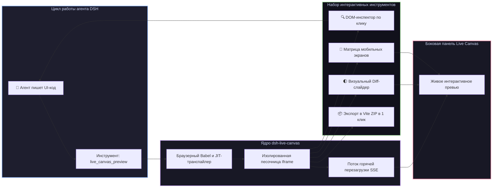

# 📦 @goodandready/dsh-live-canvas

<div align="center">

<h3>Интерактивная песочница живого превью, DOM-инспектор, визуальный Diff, матрица устройств и сборка Vite-проекта в 1 клик для DeepSeek Harness</h3>

<p align="center">
  <a href="https://www.npmjs.com/package/@goodandready/dsh-live-canvas"></a>
  <a href="LICENSE"></a>
  <a href="https://github.com/topics/dsh-plugin"></a>
  <a href="https://nodejs.org"></a>
</p>

<p align="center">
  <a href="https://goodandready.app/"></a>
</p>

<p align="center">
  <a href="README.md"><b>🇬🇧 English</b></a> •
  <a href="README.ru.md"><b>🇷🇺 Русский</b></a> •
  <a href="README.zh.md"><b>🇨🇳 中文说明</b></a>
</p>

</div>

---

## ⚡ Обзор

**`dsh-live-canvas`** даёт агентам **DeepSeek Harness** интерактивную браузерную песочницу для мгновенной визуализации, вёрстки и тестирования фронтенд-компонентов в реальном времени.

Когда агент генерирует код на HTML, React 18 (JSX/TSX), Vue, SVG, диаграммы Mermaid или Markdown, плагин мгновенно компилирует и отображает интерфейс в боковой панели с поддержкой **горячей перезагрузки (SSE Hot-Reload), инспектора элементов по клику, визуального сравнения версий (Diff), матрицы мобильных экранов и экспорта в готовый проект Vite в 1 клик**.



---

## ✨ Ключевые возможности

### 1. 🎨 Мультиформатный рендеринг в реальном времени
* **React 18 JSX/TSX**: компиляция Babel Standalone на лету, изоляция ошибок Error Boundary и сохранение состояния компонентов.
* **HTML + Tailwind CSS + Lucide Icons**: рендеринг разметки с подключением JIT Tailwind CSS и нативных иконок Lucide.
* **SVG-графика**: векторный просмотрщик с переключением сетки прозрачности и зумом.
* **Mermaid и Markdown**: отображение архитектурных диаграмм (Sequence, Flowchart) и форматированного текста.

### 2. 🔍 Интерактивный DOM-инспектор (`live_canvas_inspect`)
Позволяет пользователю и агенту навести курсор и кликнуть на любой элемент превью:
* Получение точного CSS-селектора и иерархии DOM;
* Выгрузка вычисленных стилей, размеров, цветов и отступов;
* Мгновенный цикл обратной связи для самоисправления агента.

### 3. 🌓 Визуальное сравнение версий (`live_canvas_diff`)
Интерактивный слайдер «до/после» для наглядной проверки регрессий верстки.

### 4. 📱 Матрица мобильных устройств (`live_canvas_matrix`)
Одновременное отображение интерфейса на экранах Смартфона (iPhone/Pixel), Планшета (iPad) и Десктопа.

### 5. 📦 Экспорт в готовый Vite ZIP-проект в 1 клик (`live_canvas_pack`)
Упаковывает текущий компонент в полноценный проект **Vite + React / Vue + TypeScript** с настроенными `package.json`, `vite.config.ts` и Tailwind, готовый к запуску через `npm run dev`.

---

## 🛠️ Справочник инструментов агента (13 инструментов)

| Имя инструмента | Параметры | Описание |
|---|---|---|
| `live_canvas_preview` | `code`, `format`, `title` | Отображает или обновляет превью (HTML, React, SVG, Mermaid, Markdown) |
| `live_canvas_inspect` | `selector` | Инспектирует элементы DOM, вычисленные стили и геометрию |
| `live_canvas_reload` | `preserveState` | Вызывает немедленную горячую перезагрузку песочницы |
| `live_canvas_diagnose` | `limit` | Получает логи консоли, ошибки выполнения и телеметрию |
| `live_canvas_export` | `format` | Генерирует автономный single-file HTML документ |
| `live_canvas_annotations`| `items` | Накладывает рамки подсветки и комментарии поверх интерфейса |
| `live_canvas_gallery` | `stories` | Рендерит галерею компонентов в стиле Storybook |
| `live_canvas_watch` | `path`, `glob` | Следит за файлами рабочей директории для авто-обновления |
| `live_canvas_controls` | `props` | Генерирует интерактивные ползунки для управления свойствами компонента |
| `live_canvas_diff` | `baseCode`, `newCode` | Рендерит визуальный Diff-слайдер между двумя версиями |
| `live_canvas_matrix` | `devices` | Генерирует мультиэкранную адаптивную сетку превью |
| `live_canvas_mock` | `schema` | Генерирует реалистичные мок-данные для наполнения компонентов |
| `live_canvas_pack` | `projectName` | Собирает и скачивает ZIP-архив с готовым Vite-проектом |

---

## 📦 Быстрая установка

```bash
dsh plugin --profile web add @goodandready/dsh-live-canvas
```

---

## ⚙️ Пример конфигурации (`settings.yaml`)

```yaml
dsh-live-canvas:
  enabled: true
  autoOpenOnCode: true
  enableInspector: true
  enableHotReload: true
  defaultTheme: dark
  maxBundleSizeBytes: 5242880
```

---

## 📄 Лицензия

MIT © [GooDAnDReaDY](https://github.com/GooDAnDReaDY)
