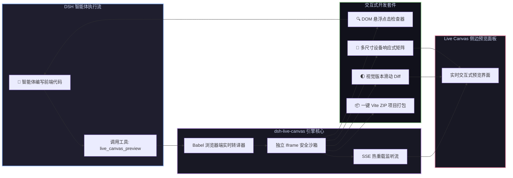

# 📦 @goodandready/dsh-live-canvas

<div align="center">

<h3>DeepSeek Harness 实时网页沙箱、DOM 元素检查器、视觉 Diff 对比与一键 Vite 项目打包插件</h3>

<p align="center">
  <a href="https://www.npmjs.com/package/@goodandready/dsh-live-canvas"></a>
  <a href="LICENSE"></a>
  <a href="https://github.com/topics/dsh-plugin"></a>
  <a href="https://nodejs.org"></a>
</p>

<!-- 官方插件展示中心跳转按钮 -->
<p align="center">
  <a href="https://goodandready.app/"></a>
</p>

<p align="center">
  <a href="README.md"><b>🇬🇧 English</b></a> •
  <a href="README.ru.md"><b>🇷🇺 Русский</b></a> •
  <a href="README.zh.md"><b>🇨🇳 中文说明</b></a>
</p>

</div>

---

## ⚡ 插件概览

**`dsh-live-canvas`** 为 **DeepSeek Harness** 智能体提供实时交互式前端沙箱，支持秒级编译、实时渲染与可视化调试。

智能体输出 HTML、React 18 (JSX/TSX)、Vue、SVG、Mermaid 架构图或 Markdown 文档时，插件自动实时构建并渲染预览，支持 **SSE 热重载、DOM 元素悬浮点击检查、视觉 Diff 差分对比、多设备响应式矩阵以及一键 Vite ZIP 项目导出**。



---

## 📦 安装指南

```bash
dsh plugin --profile web add @goodandready/dsh-live-canvas
```

---

## 📄 开源协议

MIT © [GooDAnDReaDY](https://github.com/GooDAnDReaDY)
