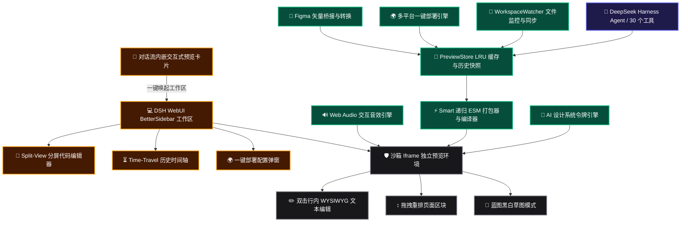

# 📦 @goodandready/dsh-live-canvas

<div align="center">

<h3>交互式前端开发工作室、Retool 风格 CRUD 数据看板引擎、Time-Travel 时间旅行调试器、多平台一键部署 (Vercel, Cloudflare, Netlify, Gist)、Figma 矢量桥接、UI 音效及 30 个智能体工具 (适用于 DeepSeek Harness)</h3>

<p align="center">
  <a href="https://www.npmjs.com/package/@goodandready/dsh-live-canvas"></a>
  <a href="LICENSE"></a>
  <a href="https://github.com/topics/dsh-plugin"></a>
  <a href="https://nodejs.org"></a>
</p>

<p align="center">
  <a href="https://goodandready.app/"></a>
</p>

<p align="center">
  <a href="README.md"><b>🇬🇧 English</b></a> •
  <a href="README.ru.md"><b>🇷🇺 Русский</b></a> •
  <a href="README.zh.md"><b>🇨🇳 中文说明</b></a>
</p>

</div>

---

## ⚡ 概述与核心解决痛点

在传统的终端与对话框环境中，代码智能体通常仅输出静态的代码片段或 Markdown 文本。这会导致：
1. **缺乏即时交互反馈**：开发者无法直接测试按钮点击、表单校验、动画转场或响应式屏幕断点，必须手动复制代码到本地工程。
2. **上下文严重割裂**：进行 UI 评审时需要在 IDE、终端、浏览器和设计工具间反复横跳。
3. **文本信息过载**：用长篇纯文本描述系统架构与项目路线图难以直观审阅。

### 解决方案：`dsh-live-canvas`
受 *The Unreasonable Effectiveness of HTML*、Plannotator 与现代可视化设计平台启发，**`@goodandready/dsh-live-canvas`** 将 DeepSeek Harness 升级为完整的独立前端开发与构件运行环境。提供内存级 ESM 模块打包、SSE 热重载、对话框内实时预览卡片、分屏代码编辑器、版本时间旅行、多平台一键部署及 **30 个专用智能体工具**。

---

## 🏛️ 系统架构关系图



---

## 🛠️ 30 个智能体工具完整速查表

| # | 工具名称 | 功能描述 | 核心参数 | 返回输出 / 触发动作 |
|---|---|---|---|---|
| 1 | `live_canvas_preview` | 渲染或更新 HTML/React/SVG/Mermaid 预览会话 | `content`, `componentType`, `title`, `theme` | `previewUrl`, `canvasId`, `success` |
| 2 | `live_canvas_inspect` | 获取用户点击的 DOM 元素、CSS 选择器与属性 | `canvasId`, `limit` | `inspections: [...]`, `count` |
| 3 | `live_canvas_reload` | 强制向当前打开的预览画布广播 SSE 热重载事件 | `canvasId` | `reloaded`, `timestamp` |
| 4 | `live_canvas_diagnose` | 查询沙箱控制台错误与异常，实现智能体自主修复 | `canvasId`, `level` | `logs: [...]`, `hasErrors` |
| 5 | `live_canvas_export` | 导出单文件零依赖独立 HTML 页面 | `canvasId`, `saveToDisk` | `downloadUrl`, `savedPath` |
| 6 | `live_canvas_annotations` | 检索或清除画布上的矩形批注与用户反馈 | `canvasId`, `action` | `annotations: [...]`, `count` |
| 7 | `live_canvas_gallery` | 渲染多组件状态 Storybook 并排对比矩阵 | `variants`, `title` | `variantsCount`, `previewUrl` |
| 8 | `live_canvas_watch` | 扫描工作区文件并绑定实时文件监控器 | `subDir`, `exts` | `files: [...]`, `watchedFiles` |
| 9 | `live_canvas_controls` | 调整 Storybook 风格的交互式 Props 滑块与开关 | `canvasId`, `values`, `schema` | `values: {...}`, `schema: {...}` |
| 10 | `live_canvas_diff` | 分屏滑块对比两个版本快照的视觉差异 | `canvasId`, `fromId`, `toId` | `diffUrl`, `snapshotCount` |
| 11 | `live_canvas_matrix` | 渲染多设备响应式屏幕矩阵 (手机、平板、桌面) | `canvasId` | `matrixUrl` |
| 12 | `live_canvas_mock` | 配置沙箱内部拦截的 Mock REST API 接口及数据集 | `canvasId`, `endpoints` | `endpointsCount`, `mockData` |
| 13 | `live_canvas_pack` | 一键生成包含完整依赖的 Vite+React / Vite+Vue ZIP 包 | `canvasId`, `framework` | `downloadUrl`, `writtenDir` |
| 14 | `live_canvas_refine_element` | 针对特定 DOM 元素执行精准的 AI 样式与结构优化 | `canvasId`, `selector`, `prompt` | `success`, `message` |
| 15 | `live_canvas_storybook` | 自动扫描组件并构建 Storybook UI Kit 对比画廊 | `subDir`, `framework` | `galleryUrl`, `componentsCount` |
| 16 | `live_canvas_insert_block` | 在项目中插入预置高端设计模块 (Hero, Bento, Pricing 等) | `blockId`, `canvasId` | `blockId`, `title` |
| 17 | `live_canvas_vision_import` | 导入屏幕截图 / 设计稿并转换为实时交互代码 | `imagePath`, `framework` | `previewUrl`, `framework` |
| 18 | `live_canvas_visual_audit` | 自动化视觉审计：检查溢出、色彩对比度与响应式断点 | `canvasId` | `score`, `issuesCount`, `issues` |
| 19 | `live_canvas_generate_mock` | 生成逼真的 JSON Mock 数据集并挂载至沙箱拦截器 | `type`, `count`, `canvasId` | `datasetType`, `mockData` |
| 20 | `live_canvas_share` | 生成手机端实时预览二维码及局域网共享链接 | `canvasId` | `shareUrl`, `qrSvg` |
| 21 | `live_canvas_create_wireframe` | 生成低保真结构蓝图线框图 HTML 构件 | `title`, `layout`, `canvasId` | `previewUrl`, `layout` |
| 22 | `live_canvas_create_plan` | 生成包含持久化状态的交互式发布计划与路线图 | `title`, `version`, `canvasId` | `previewUrl`, `version` |
| 23 | `live_canvas_create_diagram` | 生成动态交互式架构系统关系与数据流向图 | `title`, `diagramType`, `canvasId` | `previewUrl`, `diagramType` |
| 24 | `live_canvas_create_prototype` | 生成包含平滑转场的多步骤交互向导原型 | `title`, `flowType`, `canvasId` | `previewUrl`, `flowType` |
| 25 | `live_canvas_resolve_annotation` | 将画布上的用户批注标记为已解决并记录说明 | `canvasId`, `annotationId`, `note` | `status: 'resolved'` |
| 26 | `live_canvas_create_crud` | 生成包含搜索、筛选与弹窗的 Retool 风格 CRUD 数据看板 | `title`, `entityName`, `canvasId` | `previewUrl`, `entityName` |
| 27 | `live_canvas_timetravel` | 历史版本时间旅行滑动对比与一键回滚 | `canvasId`, `action`, `snapshotIndex`| `timetravelUrl`, `snapshotsCount` |
| 28 | `live_canvas_instant_deploy` | 生成适用于 Vercel、Cloudflare、Netlify 与 Gist 的部署包 | `canvasId`, `target` | `downloadUrl`, `instructions` |
| 29 | `live_canvas_figma_bridge` | Figma SVG 矢量代码转换为 Tailwind 组件或导出 SVG | `svg`, `action`, `canvasId` | `action`, `componentName` |
| 30 | `live_canvas_sound_fx` | Web Audio 交互音效合成与预览 (点击、弹窗、成功音) | `action`, `soundType` | `presetsCount`, `soundType` |

---

## 📦 安装说明

在 DeepSeek Harness 环境中一键安装：

```bash
dsh plugin --profile web add @goodandready/dsh-live-canvas
```

---

## ⚙️ 完整配置说明 (`settings.yaml`)

```yaml
plugins:
  "@goodandready/dsh-live-canvas":
    defaultViewport: "responsive" # 可选项: responsive, mobile, tablet, desktop, matrix
    autoOpenOnHtmlGen: true       # 当智能体生成界面时自动打开 Live Canvas 侧边栏
    enableHotReload: true         # 启用 SSE 实时热重载数据流
    maxSessionCache: 50           # 内存 LRU 缓存中保留的最大活跃会话数
    enableFileWatcher: true       # 启用工作区文件变动实时监控
    workspaceDir: ""              # 自定义工程根路径 (默认当前工作目录)
```

---

## 📄 开源许可证

MIT © [GooDAnDReaDY](https://github.com/GooDAnDReaDY)

